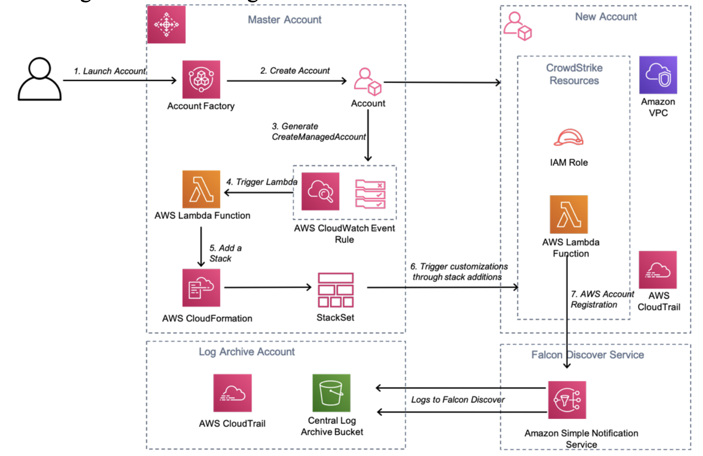
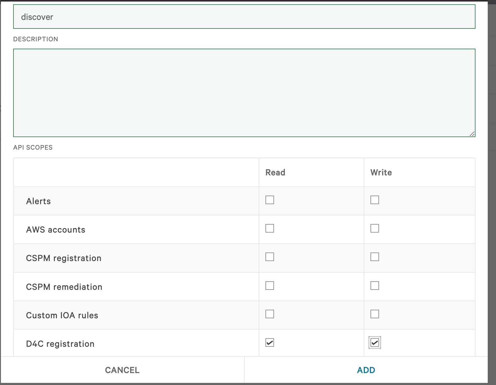
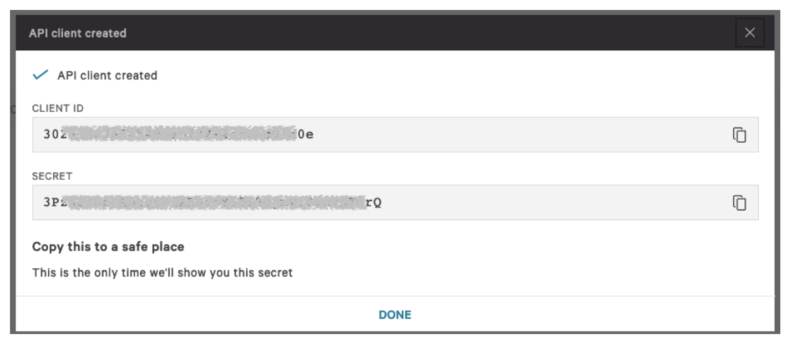

# Implementation Guide for CrowdStrike Falcon Discover for Cloud

# Recent Changes
The Falcon Discover for AWS service has recently changed its account registration and onboarding process to match that of our Horizon (CPSM) service. 

## Single Account Registration
The registration and onboarding process is broadly similar with the following notable changes. 
The account registration API endpoint has now changed to 
```/cloud-connect-aws/entities/account/v2``` with a required payload of 

```{
  "resources": [
    {
      "account_id": "987654321012"
    }
  ]
}
```
The API response now contains the iam_role_arn and external_id
```{
  "meta": {
    "query_time": 0.010077534,
    "writes": {
      "resources_affected": 1
    },
    "powered_by": "cspm-registration",
    "trace_id": "d2c4efac-91bf-4787-8a14-5af1f61add5b"
  },
  "errors": [],
  "resources": [
    {
      "ID": 16053,
      "CreatedAt": "2022-12-21T15:23:41.882692096Z",
      "UpdatedAt": "2022-12-21T15:23:41.882692096Z",
      "DeletedAt": null,
      "cid": "99957db3ada54e9c9d6983b8bd6b3edd",
      "account_id": "987654321012",
      "iam_role_arn": "arn:aws:iam::987654321012:role/CrowdStrikeCSPMReader-bsz72shnmuzi",
      "external_id": "f95d1cb3c9544f45b6e3e0d0e5fbba14",
      "status": "Event_DiscoverAccountStatusProvisioned",
      "is_master": false,
      "aws_permissions_status": [],
      "cloudformation_url": "https://console.aws.amazon.com/cloudformation/home?region=us-east-1#/stacks/create/review?templateURL=https://cs-prod-cloudconnect-templates.s3-us-west-1.amazonaws.com/aws_cspm_cloudformation_d4c_v2.json&stackName=CrowdStrike-CSPM-Integration&param_ExternalID=f95d1cb3c9544f45b6e3e0d0e5fbba14&param_RoleName=CrowdStrikeCSPMReader-bsz72shnmuzi&param_CSRoleName=CrowdStrikeCSPMConnector&param_CSAccountNumber=292230061137",
      "account_type": "commercial",
      "settings": {},
      "valid": true,
      "is_custom_rolename": false
    }
  ]
}
```
There is no longer the need to setup SNS notifications from cloudtrail as the account will now be scanned on a periodic basis.   The interval can be set with a minimum scan time of two hours. 

Once registered CrowdStrike will perform an initial scan by attempting to assume the speicifed role in the account and issuing API commands to retrieve details of your EC2 and IAM resources.


## Single Account Registration


# Foreword
With CrowdStrike Discover for Cloud and Containers you can gain immediate and comprehensive visibility into all managed endpoints equipped with CrowdStrike Falcon workload security, and unmanaged assets across all accounts. In addition, Discover for Cloud and Containers is able to cross boundaries to see Amazon Virtual Private Cloud (Amazon VPC) and subnets, and collect data from all endpoints -- even those that are unmanaged -- as well as all hybrid infrastructure. The rich AWS content Discover for Cloud and Containers allows organizations to quickly understand and prioritize instances and immediately ensure that the Falcon sensor is fully deployed, dramatically improving organizations' security positions.

The purpose of this Implementation Guide is to enable every AWS Marketplace customer to seamlessly activate, deploy, and configure, CrowdStrike Discover for Cloud and Containers in an AWS Control Tower environment while taking full advantage of the resources pre-configured by AWS Control Tower as part of the initialization.

# Solution Overview and Features
## Benefits of CrowdStrike Discover for Cloud and Containers
CrowdStrike Discover for Cloud and Containers offers streamlined integration not available with other third-party solutions. This integration saves organizations the time and expense of trying to develop these capabilities in-house. Discover for Cloud and Containers offers the following benefits:

* **Identifies security gaps with comprehensive and consistent visibility across all Amazon Elastic Compute Cloud (Amazon EC2) instances and endpoints.** 
By uniquely combining information from Discover for Cloud and Containers and AWS metadata, security teams are able to baseline existing Amazon EC2 deployments instantly across all regions and subsequently monitor AWS CloudTrail logs for any modifications to the environment. This holistic asset management across entire data centers and AWS cloud resources allows you to identify unmanaged assets -- pinpointing security gaps and closing them.

* **Prioritizes detections for faster and more effective response.**
Discover for Cloud and Containers delivers rich AWS metadata on EC2 instances, so that unprotected assets and impacted systems are quickly prioritized. It provides the critical answers analysts need such as: Is this system internet accessible? Does it have AWS Identity and Access Management (IAM) roles applied with elevated privileges? Is it on the same Amazon VPC as critical assets? Armed with this context-rich information, organizations can apply proactive measures to dramatically improve their security posture.

* **Ensures consistent security across hybrid environments**.
As organizations move to the cloud, they are implementing hybrid data center with workloads running on-premises and in the cloud, which can impede a consistent level of security. Discover for Cloud and Containers provides visibility across all assets whether they are on-premises or EC2 instances in AWS. In addition, the visibility extends to both managed and unmanaged assets -- allowing organizations to quickly ensure that all assets are being protected.

* **Conserves resources with easy deployment and integrated management.**
Often security teams find they must pivot across a variety of tools and workflows as they attempt to span physical, virtual, and cloud environments. Discover for Cloud and Containers is one tool that provides instant visibility and control over existing on-premise endpoints and EC2 instances without requiring any additional agents, or installing scripts that can burden teams and slow performance. As a cloud-native security tool, Discover for Cloud and Containers deploys instantly and scales easily with no hit to performance and no requirement to reboot. It is powered by the Falcon sensor, a single lightweight agent, and managed via the unified Falcon console.

# Architecture Diagram
Falcon Discover for Cloud and Containers has read-only access to your EC2 metadata. This minimizes the security impact to your AWS infrastructure. It calls AWS APIs on your behalf using a cross account IAM role, and it also processes CloudTrail logs.

Falcon Discover for Cloud and Containers monitors CloudTrail logs stored in your log archive account Amazon Simple Storage Service (Amazon S3) bucket. When a new log file is written to the S3 bucket, an Amazon Simple Notification Service (Amazon SNS) notification is sent to the SNS topic hosted in a CrowdStrike account.

CrowdStrike will require the ability to assume an IAM role that allows the ``s3-GetObject`` permissions on the S3 bucket hosting your CloudTrail logs.

CrowdStrike will analyze the logs in the log file, if an event of interest is found it will make an API call to the account where the log was created and gather information about the resources that have been created.



1) The Customer creates a new AWS account using Account Factory within AWS Control Tower Master account.

2) Account Factory creates a new AWS account and applies baseline guardrails.

3) On completion of account creation a ``CreateManagedAccount`` event notification is generated. Reference the AWS documentation at [https://docs.aws.amazon.com/controltower/latest/userguide/lifecycle-events.html#createmanaged-account](https://docs.aws.amazon.com/controltower/latest/userguide/lifecycle-events.html#createmanaged-account).

4) The CloudWatch event rule triggers a Lambda function that will generate account specific parameters.

5) The custom parameters are passed to the StackSet that is applied to the new account.

6) The stack creates an additional IAM role. This role will allow CrowdStrike to assume a role with the following permissions:
    
    * *ec2:DescribeInstances*
    * *ec2:DescribeImages*
    * *ec2:DescribeNetworkInterfaces*
    * *ec2:DescribeVolumes*
    * *ec2:DescribeVpcs*
    * *ec2:DescribeRegions*
    * *ec2:DescribeSubnets*
    * *ec2:DescribeNetworkAcls*
    * *ec2:DescribeSecurityGroups*
    * *iam:ListAccountAliases*


# Pre-requisites
Customers will require the following:
* Subscription to the Falcon Cloud Workload Protection Bundle.

CrowdStrike will pass an ``externalid`` when trying to assume a role in the log archive account to read the log files. We recommend that you become familiar with the following article:

How to Use an External ID When Granting Access to Your AWS Resources to a Third Party:
[https://docs.aws.amazon.com/IAM/latest/UserGuide/id_roles_create_for-user_externalid.html](https://docs.aws.amazon.com/IAM/latest/UserGuide/id_roles_create_for-user_externalid.html)

Note: the ``externalid`` is a string of random characters.

If you are new to AWS, see Getting Started with AWS:
[https://aws.amazon.com/getting-started/](https://aws.amazon.com/getting-started/)

For additional information on AWS Marketplace:
[https://aws.amazon.com/marketplace/help/about-us?ref_=footer_nav_about_aws_marketplace](https://aws.amazon.com/marketplace/help/about-us?ref_=footer_nav_about_aws_marketplace)

To get started with AWS Control Tower, review the User Guide:
[https://docs.aws.amazon.com/controltower/latest/userguide/getting-started-with-control-tower.html](https://docs.aws.amazon.com/controltower/latest/userguide/getting-started-with-control-tower.html)

# Deployment Configuration Steps

## Step 1: Subscribe to Falcon for AWS in the AWS Marketplace

1) Configuration: Solution to Deploy
Setup consists of the following high-level tasks:

* Load the CloudFormation template *Falcon_Discover_Control_Tower.yaml* in the ``master`` account.

1) Generate CrowdStrike Falcon API Keys.

    First login to the CrowdStrike console and go to ``Support --> API Clients and Keys``. Obtain CrowdStrike OAuth2 keys from the Falcon Console. Copy the ``CLIENT ID`` and ``SECRET`` as these will be used in the template.
    
    
    

    
2) Load the CloudFormation template Falcon_Discover_Control_Tower.yaml in the ``master`` account.

      Fill in the missing parameter values 

      
| Parameter             | Description                                                                                                   |
| --------------------- |-------------------------------------------------------------------------------------------------------------- |
| FalconClientID        | Falcon API Key Client ID                                                                                      |
| FalconSecret          | Falcon API Key Secret                                                                                         | 
| CSCloud               | CrowdStrike Cloud (us1, us-2 or eu-1)   |           
| QSS3BucketName        | Quick Start S3 Bucket Name (Do not change unless you are modifying the template and staging your own files)   |
| QSS3BucketRegion      | Quick Start S3 bucket region (Do not change unless you are modifying the template and staging your own files) |
| S3KeyPrefix           | Quick Start S3 Key Prefix (Do not change unless you are modifying the template and staging your own files)    |
| CTAdminRoleName       | Control Tower StackSet adminisistration Rolename (Do not change unless using custom role names)               | 
| CTExecutionRoleArn    | Control Tower StackSet Execution Rolename   (Do not change unless using custom role names)                    | 


   The CloudFormation template will create the following resources in the account:

   CrowdStrike-CSPM-Integration

* StackSet *CrowdStrike-CSPM-Integration* that will be applied to all new accounts.(The template is discover-role-stackset.yaml in the Cloud-AWS/Control-Tower/cloudformation folder)

* Stack  *CrowdStrike-CSPM-Integration* that is applied to the master account (The template is discover-role.yaml in the Cloud-AWS/Control-Tower/cloudformation folder)
  
* CloudWatch rule to trigger a lambda function.

* Lambda function triggered by CloudWatch to push the StackSet to a new account (manage_account_lifecycle.py)

